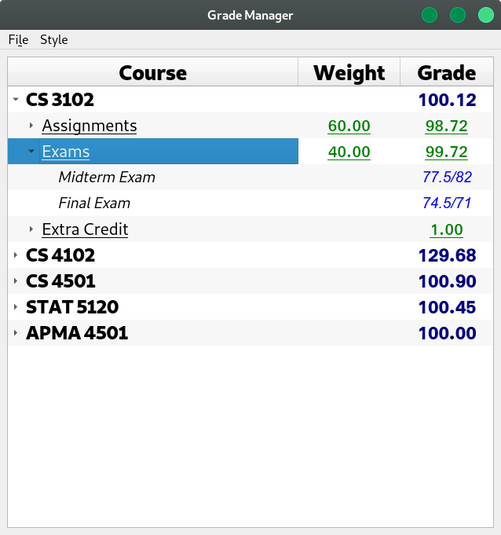
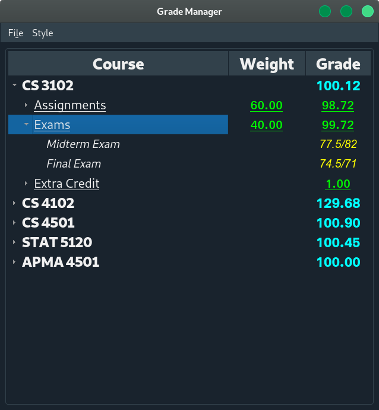
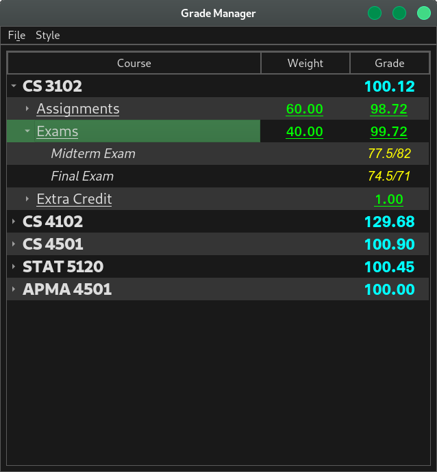

# Purpose

The purpose of this application is to provide a convenient way for students to track their grades for multiple courses.

# Application Description
The application was created using PyQT5.  The application consists of a single window containing a menubar and a tree table widget.  It comes with three different styles: a light theme and two dark themes.





## How to use the Application
Clone this repository and install python3 if you haven't already (3.7 was used for the development of the application).  If PyQt5 isn't installed, then running `pip3 install -r requirements.txt` or some variant similar to the command listed should work.  Once everything is setup, running `python3 gui.py` or some similar variant will launch the application.  Alternatively, there is a windows executable in the dist directory, though it is not always up to date.

```bash
git clone https://github.com/jrodal98/Grade_Manager.git
cd Grade_Manager
pip3 install -r requirements.txt
python3 gui.py
```

### Adding a Course
To add a course, right click anywhere blank area in the table or an existing course and select "Add New Course."  Alternatively, press the "Insert" key while not touching any tree items.  Double click the new item to edit its name, or select the item and press the "F2" key.  The Grade Section for the course will be updated automatically as assignments are added and/or removed.

### Removing a Course
To remove a course, right click the course and select "Remove Selected Course." Double click the new item to edit its name.  Alternatively, select the course and press the "Delete" key.

### Adding an Assignment Type (Exams, HW, etc)
To add an Assignment Type for a course, right click the course and select "Add New Assignment Type." Alternatively, select the course and press the "Insert" key. Double click the new item to edit its name, or press the "F2" key. You should put a percent weight in "Weight" column following one of the following formats:
- decimal format (ex: 10% becomes .1 or 0.1)
- fractional format (ex: insert 1/5, 55/100, etc)

### Removing an Assignment Type
To remove an assignment type, right click the assignment type and select "Remove Selected Assignment Type." Alternatively, select the assignment type and press the "Delete" key.

### Adding an Assignment
To add an assignment for an assignment type, right click the assignment type and select "Add New Assignment."  Alternatively, select the assignment type and press the "Insert" key.  You should put a percent value for the grade received on the assignment in the "Grade" column.  If the assignment has not yet been graded, simply leave the "Grade" column blank.  The grade value should be one of the following formats:
- decimal format (ex: 96.5% becomes .965 or 0.965)
- fractional format (ex: insert 49/50, 112.5/139, etc)

### Removing an Assignment
To remove an assignment, right click the assignment type and select "Remove Selected Assignment."  Alternatively, select the assignment and press the "Delete" key.

### Adding an Extra Credit Category
This one works slightly different than the rest of the options listed above.  The purpose
of the extra credit category is to add an unweighted amount of extra credit directly
to a final course grade.  To do this, right click on the course and select the
extra credit option.  Then, add assignments like normal.  Make sure that the assignment
grades that you assign are the raw percentages that you want to add to the course grade.
For example, if you want to add 2% of extra credit to your final grade, you would
want to create an assignment and then give it a grade of 0.02, or create multiple assignments
that add up to a grade of 0.02.

### Reordering Courses, Assignment Types, and Assignments
This is reasonably intuitive.  Simply drag and drop the label wherever you want it to go.

### Saving files, opening files, and similar
It basically works the same as any other software.  Just go to the File menubar or use common shortcuts (Ctrl+S is save, etc).  The extension for the application is .grdb, short for gradebook.

## Current Features
- File saving and opening
- Adding courses, assignment types, assignments, weights, and grades
- Add extra credit assignments
- Add raw extra credit to final course grade
- Reorder courses, assignment types, and assignments.
- Grade Calculation
  - Remove specific assignments from grade calculation if desired
- Edit using familiar keybinds
- Choose between the default light theme or two dark themes
- Application caches settings
  - Upon rebooting the application, the previously selected file and theme will be active.

## Features to implement in the future
- Create a setting that allows for a point based grading system as an alternative
to the weight based system currently implemented.
- Undo/Redo functionality
